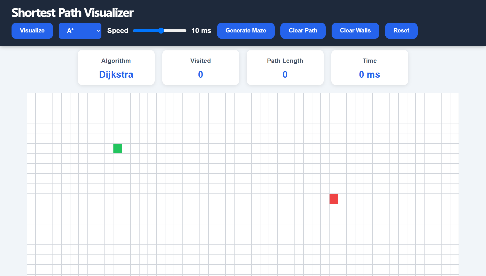
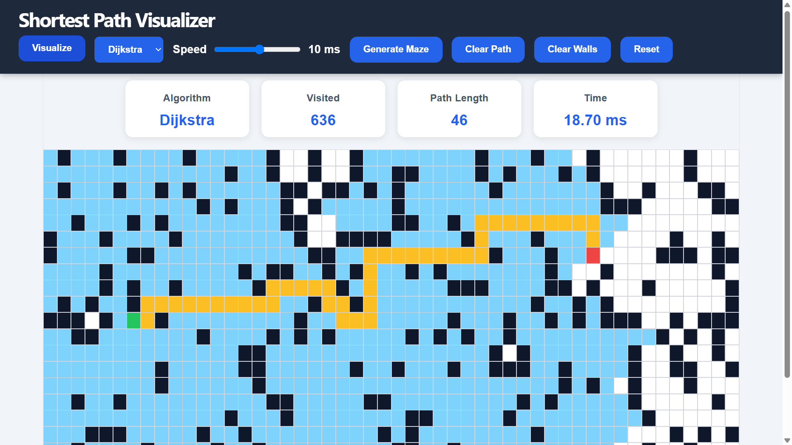
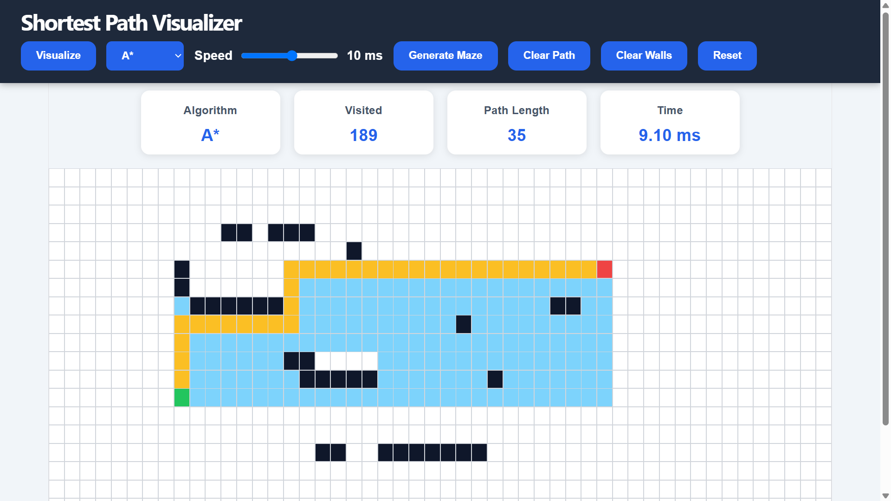

# 🚀 Shortest Path Visualizer

An interactive web application that visualizes how pathfinding algorithms discover the shortest path between two nodes. Users can draw obstacles, generate random mazes, move the start/end nodes, and compare Dijkstra's Algorithm with the A* Search Algorithm through real-time animations.

## 📸 Preview

| Home Screen | 
| :---: |
|  |

| Dijkstra Algorithm | A* Algorithm |
| :---: | :---: |
|  |  |

---

## 🌐 Live Demo

🔗 https://shortest-path-visualizer-five.vercel.app/

---

## ✨ Features

- 🎯 Visualize **Dijkstra's Algorithm**
- ⚡ Visualize **A* Search Algorithm**
- 🧱 Draw and erase walls
- 🖱️ Drag Start and End nodes
- 🎲 Generate Random Maze
- 🎞️ Adjustable animation speed
- 📊 Statistics Panel
  - Algorithm Used
  - Visited Nodes
  - Path Length
  - Execution Time
- 🧹 Clear Path
- 🧹 Clear Walls
- 🔄 Reset Grid
- 🎨 Smooth animations and modern responsive UI

---

## 🛠️ Tech Stack

- React.js
- JavaScript (ES6)
- HTML5
- CSS3
- Vite

---

## 🧠 Algorithms Implemented

### Dijkstra's Algorithm

- Finds the shortest path in weighted graphs.
- Guarantees the optimal path.
- Explores nodes based on minimum distance.

**Time Complexity**

```
O(V²)
```

---

### A* Search Algorithm

- Uses a heuristic (Manhattan Distance).
- Faster than Dijkstra in most practical scenarios.
- Guarantees the shortest path when the heuristic is admissible.

**Time Complexity**

```
O(E)
```

(With an efficient priority queue implementation.)

---

## 🚀 Getting Started

Clone the repository

```bash
git clone https://github.com/Kapil778/shortest-path-visualizer.git
```

Move into the project

```bash
cd shortest-path-visualizer
```

Install dependencies

```bash
npm install
```

Run the development server

```bash
npm run dev
```

Open

```
http://localhost:5173
```

---

## 📂 Project Structure

```
src/
│── algorithms/
│     ├── dijkstra.js
│     ├── astar.js
│
│── App.jsx
│── App.css
│── main.jsx

public/

package.json
```

---

## 🎮 How to Use

1. Draw walls by clicking and dragging on the grid.
2. Drag the Start and End nodes.
3. Select an algorithm.
4. Adjust animation speed.
5. Click **Visualize**.
6. Watch the algorithm explore the grid and highlight the shortest path.

---

## 📈 Future Improvements

- Breadth First Search (BFS)
- Depth First Search (DFS)
- Greedy Best First Search
- Bidirectional Search
- Recursive Division Maze
- Prim's Maze Algorithm
- Kruskal Maze Algorithm
- Weighted Nodes
- Diagonal Movement
- Mobile Responsive Layout

---

## 👨‍💻 Author

**Kapil Sharma**

GitHub: https://github.com/Kapil778

LinkedIn: https://www.linkedin.com/in/kapil-sharma-470aba338
---

## ⭐ If you found this project helpful, consider giving it a star!
